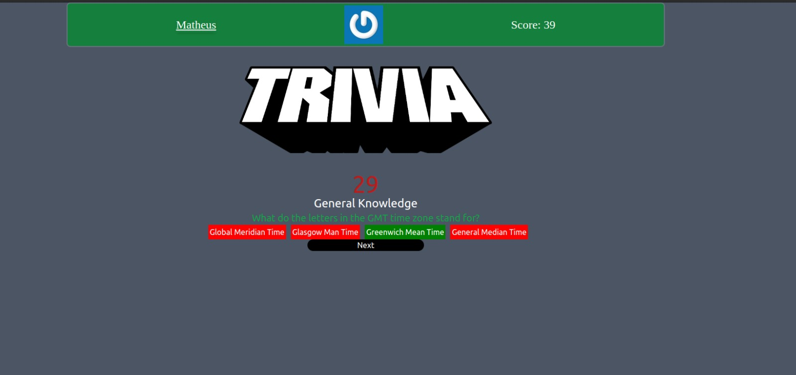

<!-- Olá, Tryber!
Esse é apenas um arquivo inicial para o README do seu projeto.
É essencial que você preencha esse documento por conta própria, ok?
Não deixe de usar nossas dicas de escrita de README de projetos, e deixe sua criatividade brilhar!
:warning: IMPORTANTE: você precisa deixar nítido:
- quais arquivos/pastas foram desenvolvidos por você; 
- quais arquivos/pastas foram desenvolvidos por outra pessoa estudante;
- quais arquivos/pastas foram desenvolvidos pela Trybe.
-->

<h1 align="center">Jogo de Trivia</h1>

  
Nesse projeto foi feito um jogo de perguntas e respostas baseado no jogo Trivia (tipo um show do milhão americano) utilizando React e Redux, desenvolvido em grupo seguindo metodologia ágil de acordo com as demandas definidas em um quadro Kanban.
  

 

  
<strong>🛠 Tecnologias utilizadas</strong>
 
### 🛠 Tecnologias

As seguintes ferramentas foram usadas na construção do projeto:

- [TailWind CSS](https://tailwindcss.com/)
- [React](https://legacy.reactjs.org/docs/getting-started.html)
- [Redux](https://react-redux.js.org)
- [RTL](https://react-redux.js.org/introduction/getting-started)
- [VSCode](https://developer.mozilla.org/pt-BR/docs/Web/JavaScript)
 

  
<strong>🧑‍💻 Habilidades</strong>
 
### 🧑‍💻 As seguintes habilidades foram necessárias para realização desse projeto:

- Criar um store Redux em aplicações React

- Criar reducers no Redux em aplicações React

- Criar actions no Redux em aplicações React

- Criar dispatchers no Redux em aplicações React

- Conectar Redux aos componentes React

- Criar actions assíncronas na sua aplicação React que faz uso de Redux.

- Escrever testes para garantir que sua aplicação possua uma boa cobertura de testes.

  

  
<strong>🏪 O que foi desenvolvido</strong>
 
<h1 align="center">
  
</h1>
  

  
<strong>🛠 Como rodar o projeto</strong>
 

 1 - Clone o repositório
  
 2 - Instale as dependências:
   - `npm install`
  
 3 - Inicialize o projeto:
   - `npm start`
  
 4 - Acessar no Browser:
   - `http://localhost:3000`
 

  
<strong>Desenvolvedores</strong>
 

- [Matheus Campos](https://github.com/MatheusCdeOliveira)
- [Diogo Vieira](https://github.com/diogocav)
- [Giordano Mendes](https://github.com/Giordano94)
 

